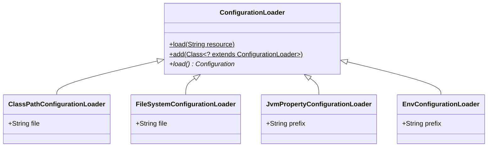

# Configuration Model

Phoenix provides a centralized way to load configuration form various sources.
The entire functionality is captured
by `common.configuration.ConfigurationLoader` and uses the configuration format
provided by
the [Apache Commons Configuration](https://commons.apache.org/proper/commons-configuration)
project.

The `ConfigurationLoader` is `abstract` and will scan the classpath for
implementations of itself and register them as loaders. Each concrete loader
must be annotated with `common.ResourcePrefix` to match the loader to a prefix
used in the resource identifier. You can also add your custom loaders and load
configuration by using a resource identifier.

`ConfigurationLoader` does not make assumptions on where the sources are
stored (e.g. local computer, network, database, etc.) and how the configuration
looks like (e.g. properties file, XML, YAML, etc.). Moreover, it does not make
any assumptions on how a resource identifier looks like neither (
e.g. `String` or `java.net.URL`), as it must be passed to an implementation via
constructor argument or setter.

## Example

## Architecture

There are default implementations of `ConfigurationLoader` that you can use
right ahead:

- `ClassPathConfigurationLoader` to load resources from the classpath (
  prefix: `classpath`)
- `FileSystemConfigurationLoader` to load resources from the file system (
  prefix: `file`)
- `JvmPropertyConfigurationLoader` to load resources from JVM properties (
  prefix: `jvm`)
- `EnvConfigurationLoader` to load resources from environment variables (
  prefix: `env`)



## Automatic loading

By using prefixes, `ConfigurationLoader` will automatically choose the right
loader. E.g. `ConfigurationLoader.load("classpath:example.properties")` will
load the file `example.properties` from the classpath.

You can define your custom configuration loaders by
extending `ConfigurationLoader` and annotating the class the `ResourcePrefix`,
providing a not-yet registered prefix. Just add the loader by
calling `ConfigurationLoader.add(LOADER)`.

Consult the JavaDoc for more details.

## Configuration Sources

### Classpath

The `ClassPathConfigurationLoader` allows loading configuration from properties
files that are on the classpath. This loader can be addressed by using the
prefix `classpath`.

Example:

```java
public class ClassPathLoaderExample {
    public static void main(String[] args) {
        Configuration configuration = new ClassPathConfigurationLoader("example.properties").load();
        System.out.println(configuration.getString("message"));
    }
}
```

with `src/main/resources/example.properties`:

```properties
message=hello
```

### File System

The `FileSystemConfigurationLoader` allows loading configuration from properties
file that are on the local file system. This loader can be addressed by using
the prefix `file`.

Example:

```java
public class FileSystemLoaderExample {
    public static void main(String[] args) {
        Configuration configuration = new FileSystemConfigurationLoader("~/example.properties").load();
        System.out.println(configuration.getString("message"));
    }
}
```

with `~/example.properties`:

```properties
message=hello
```

### JVM Properties

The `JvmPropertyConfigurationLoader` allows loading configuration from JVM
properties. This loader can be addressed by using the prefix `jvm`.

Example:

```java
public class JvmPropertyLoaderExample {
    public static void main(String[] args) {
        Configuration configuration = new JvmPropertyConfigurationLoader("").load();
        System.out.println(configuration.getString("example.message"));
    }
}
```

with JVM property `example.message=hello`.

If you just want to load properties matching a prefix, such as all properties
starting with `example`, you can pass that prefix to the constructor.

### Environment Variables

The `EnvConfigurationLoader` allows loading configuration from environment
variables. This loader can be addressed by using the prefix `env`.

Example:

```java
public class EnvLoaderExample {
    public static void main(String[] args) {
        Configuration configuration = new EnvConfigurationLoader("").load();
        System.out.println(configuration.getString("example.message"));
    }
}
```

with environment variable `EXAMPLE_MESSAGE=hello`.

If you just want to load variables matching a prefix, such as all properties
starting with `EXAMPLE`, you can pass that prefix to the constructor.
